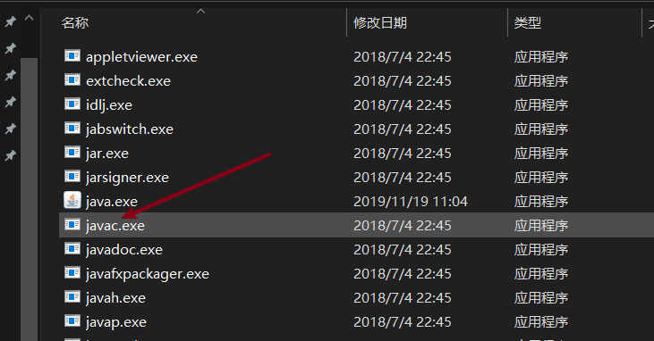
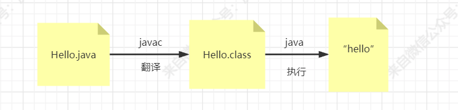
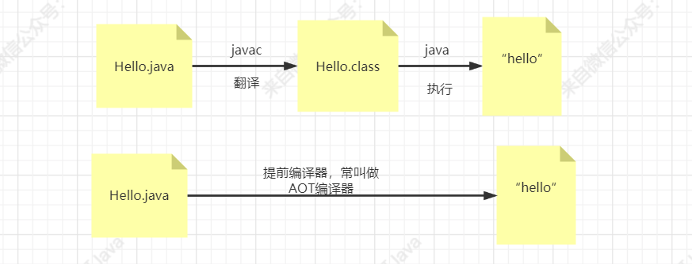
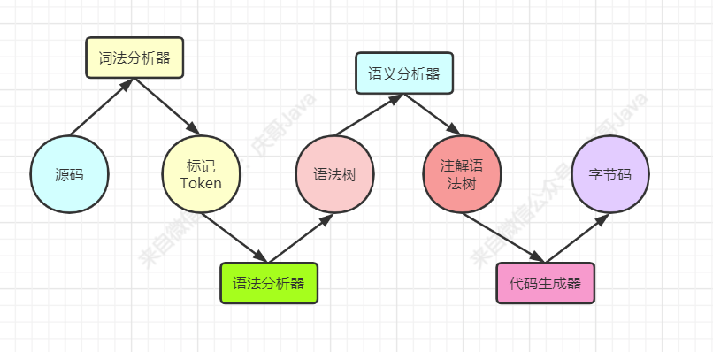

# 你不知道的javac

这一节的内容还是来分析一个我们常见的JDK指令，就是javac，首先就是关于这个javac的书写，我们看JDK中的展示：

这里写作javac，但是我在相关书籍上看到关于这块的介绍，大多数是采用Javac的写法，这个可能你们没有在意过，包括JDK的书面写法，我们下载的JDK是这样的“jdk”，然后在一些书籍描述中会采用“JDK”这种纯大写的形式，正如今天要说的“Javac”，关于这个大家知道怎么回事就行，怎样写其实我觉得问题不大，看个人习惯吧！

因此，后续描述均采用“jdk”和“javac”！

# 你对编译器了解多少

首先，我们都知道，我们平常写的后缀为.java的文件叫做Java的源文件，我们一般需要通过javac命令将其翻译成字节码文件，也就是class文件，再由java指令去执行这个class文件，是这样的一个过程：

这里从java文件翻译成class文件主要是由这个javac指令提供作用，那这个javac到底是个啥呢？

它其实是一个编译器，而且是一个前端编译器，说到这里，我觉得应该不少人跟我第一次听说一样，什么，前端编译器？看来又要涨知识了！

以前只知道使用javac指令把java文件翻译生成字节码文件，至于这个javac到底是个啥，还真的没有好好研究过！

那么现在你至少应该了解了，其实javac是一种编译器，而且还是属于前端编译器，那我当初在看到这块的时候，就在想，为什么叫做前端编译器，难道还有后端编译器，最起码还会有其他的编译器，不会仅仅只有这一个前端编译器！

可是就我目前所了解的知识，对于java而言，是不是就是知道一个java源文件被翻译成字节码文件的过程，这个是由javac编译器完成的！

想一想，知道了，后续不是还有这一个步骤嘛：

那其实这一步也有一个编译器在出力干活，那就是Java虚拟机的即时编译器，也叫作JIT编译器，不知道你听过没有，这里的编译工作就是将字节码翻译成目标机器码从而去执行程序了！

ok，到了这里，想必你跟我一样，又涨知识了，至此，我们知道了前端编译器javac把java源文件翻译成字节码文件，然后Java虚拟机在运行期间通过即时编译器将字节码文件再次翻译成目标源代码，从而执行程序！

知识拓展：这里大家需要注意的就是，无论是前端编译器javc还是即时编译器JIT，我在说的时候都是在说成翻译，为啥是翻译，之前讲过，代码的翻译有两种，一种是编译，一种是解释，编译是那种一次性把所有的代码都转换完成，而解释则是一步步来，不是一次性搞定，javac的翻译属于编译，而JIT的即时编译器则属于解释

那除了前端编译器和即时编译器之外，对于Java而言，还有个提前编译器的概念，就是解释，不通过java从把java源文件翻译成字节码再翻译成目标机器码，而是一步到位直接把java源文件翻译成目标机器码：

那到了这你，你想下，你是不是还是对javac这个所谓的前端编译器更为熟悉，其实我也一样，所以后续，咱们以这个javac的探讨学习为主！

可是我需要告诉大家一个不好的消息，那就是接下来关于javac的学习是比较难的，正如我在学习java虚拟机的时候，等到了学习class文件结构，准确来说是学习字节码的时候，就觉得难度一下子上来了，有的时候我在学习一些技术知识点的时候就感觉，在自己某个阶段去学习某个知识点的时候，真的是非常难理解！

这几个可能由于自己目前掌握的知识量还不够，或者缺乏某一个关键信息知识点，导致对当前知识点的学习存在一定的阻碍，所以理解起来比较困难，当然，我其实是一直相信，对于再难的知识，只要有人能通俗易懂的讲出来，所听所看之人也会觉得顿时豁然开朗！

# javac是如何编译的

我们继续往下学习javac这个前端编译器的话，就要学习很重要的四个知识点了，分别是：

1. 词法分析
2. 语法分析
3. 语义分析
4. 字节码生成器

这块的知识其实就是属于javac的编译原理了，以上四个知识点就是javac将源代码编译生成目标机器码的一个过程，有这么一个图，大家可以看下：

在实际的学习中，我是觉得这块比较难理解的，因为这些技术名词都是非常抽象的概念性名词，即使你看了介绍，你也是云里雾里，不知道到底是个啥！

我在网上搜索关于“javac编译原理”相关的文章的知识后，无一例外，基本全是参考两本书籍：

1. 周志明的《深入理解java虚拟机》
2. 许令波的《深入分析Javaweb技术内幕》

而大家参考的比较多的则是许令波的《深入分析Javaweb技术内幕》，其实我们在学习知识的时候，参考相关书籍那是再正常不过了，我也是参考很多资料去学习一些新知识，但是这里有个很重要的点：

我学习一个知识，参考各种书籍和资料，为的是自己能够更加深入和透彻的去理解这个知识点，做到自己真正的明白，然后写文章的话，我会用自己的理解把该知识点通俗易懂的写出来，讲给大家听，希望做到的是大家看我的文章去理解相应知识点更加的容易，也就是让大家看得懂！

因为我一直觉得，有些书写的虽然很好，但是由于语言过于术语话和官方话，导致我们听不懂看不明白，这个也许因为作者本身的高度就很高，他站在他的理解层次觉得写的已经很通俗易懂了，但是放在我们这里，犹如天书一般，或者一个不好的现象就是作者写作本书，参考的是国外资料，也就是把英文翻译成中文，并没有经过自己的理解去通俗化，从而导致这种现象！

就好比我在网上看到的这些关于javac编译相关的文章，大多数文章简直就是直接照抄许令波的《深入分析Javaweb技术内幕》中关于javac编译相关的描述，我觉得这个就很没价值了！

因此，我目前在想写一些技术文章的时候，也在尽量要求自己多思考，关于知识点的描述尽量是自己的理解，而不是照抄！我想经过我自己理解的知识写出来会更加的接地气，更加的通俗易懂，也更加的对你们有价值，前提是，我要真正的去学懂这个知识，所以，学习，是不能停止的！

在书中，去讲解这块知识的时候其实是深入javac的源码的，javac是个编译器，而它是直接使用java语言实现的，不像Java虚拟机，是使用C++语言实现的，所以对于我而言，javac的源码是可以去学习的，但是说实在的，我觉得自己目前去读javac的源码着实有点吃力了！

因此，有能力的可以去看看javac源码的分析，毕竟看源码，才是解决知识底层的最好的方式，你可以去看《深入分析Javaweb技术内幕》中关于javac编译相关的描述，具体就是第四章节《Javac编译原理》。

接下来我就根据我的学习理解给大家介绍下一下四个内容：

1. 词法分析
2. 语法分析
3. 语义分析
4. 字节码生成器

## 词法分析

首先我们看名字，包括后面的语法分析，还有语义分析，这些有没有感觉像是在学习英语一样，我觉得在学习英语的时候语法是比较难理解的，因为它比较抽象，什么主谓宾，主从，动宾啥啥的，说的简单点，这玩意是不是就像是一个规范或者是规定，告诉你说一句话应该怎样说是对的，怎样说才能被别人理解！

我们知道javac的目的就是把java源文件转变成字节码文件，那这中间肯定需要有的一个过程就是转换的一个过程，这个转换就是一步步的把java源文件转换成更加接近或者可以通过某个东西（字节码生成器）生成真正的字节码文件的过程！

那什么叫做词法分析，我们知道java中有一些关键词吧，。比如if，else，for这些等等，书中举的例子很好，比如我们的汉语，或者给你一句话，你得能找出来这句话中哪些是词语，哪些是标题符号吧。那这里的词法分析就是找出java源代码中的关键词等等，然后找出来的这些东西组成一个叫做token流的东西！

看这个图，词法分析的产物就是Token，那理解这个Token就又是一个关键，那这个Token它其实是一个枚举类，那现在，你就简单的理解成所谓的Token流就是一些关键词集合。

## 语法分析

我们通过第一步的词法分析整出来了一个Token合集，就是各个关键词，那这里的语法分析是啥，所谓的语法分析，就是看你说的话对不对啊，比如我们汉语，一句话一般包括主谓宾这些，那放到java的代码里面的，比如if，后面是不是得跟个括号，里面是布尔表达式，所以这里的语法分析就是我得看看你这个if关键词后面跟的是不是一个布尔表达式，这就是语法分析！

而这一步的操作的结果就是生成一个语法树，简单理解就是把得到的相关关键词配上正确的语法进行互相组合，然后组合成一个新的结构化的语法表达式形式。

是不是很抽象，这说的都是啥跟啥的，简单点理解就是，词法分析得到的各个关键词，把他们组合在一起，组合的规则就是语法分析的一些规则，然后组合生成了一个叫做语法树的东西！

就这么先理解着，有个印象就行！

## 语义分析

这个语义分析就是把比较难懂的给精简化，翻译成更加好懂的，比如文言文翻译成大白话，这是javac做的一些内部操作，明面上我们只需要知道这部分的操作就是一个精简化，注解化的操作，为的是更加好懂！

就是在语法树的基础上再修饰修饰，把复杂的简单化，比较难懂的加上注释等等，然后形成一个新的注解语法树！

这个注解语法树就是之前说的那个更加接近字节码的东西！

## 字节码生成器

然后是最后一步，这个字节码生成器根据上述语义分析得到的注解语法树生成相对应的字节码！

# 小结

不知道对于词法分析，语法分析，语义分析和字节码生成器你是不是有所了解了，其实我这里说的都是基本的概念，本身这些概念性知识是比较抽象的，而我的理解也不是很深入，只能做上述的一些简单描述，其实这块的知识是比较有难度的，大家即使看不懂也没关系，随着大家的学习，会逐渐的明白，我也会不断的补充新知识，力求后续给大家带来更加通俗易懂的讲解！

咱们一起加油！