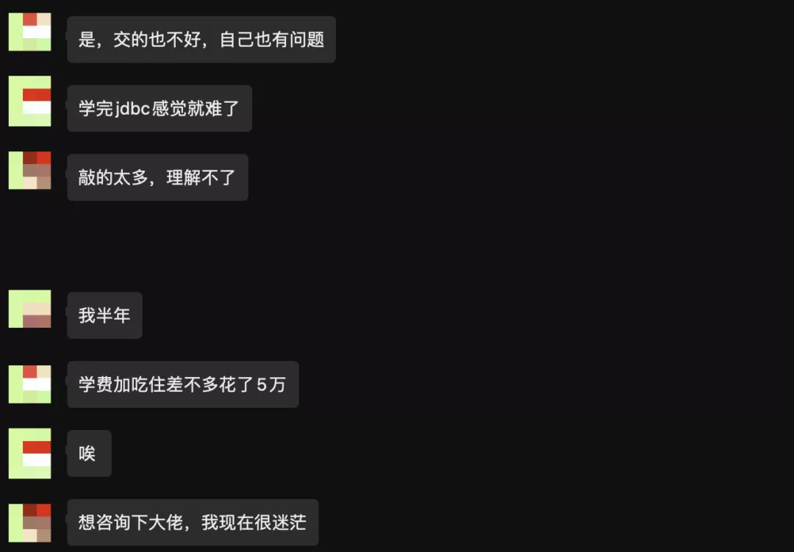
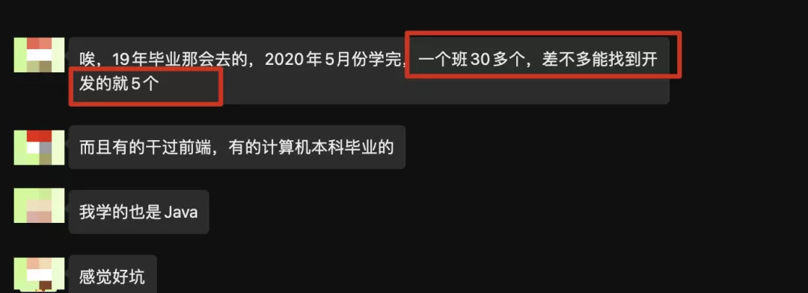

其实我发现，咱们这些学习计算机行业的**对于“培训”似乎一直都是绕不开的**，那我这里就先跟大家聊下关于培训这件事情，另外我必须告诉你，我不反对培训，但是培训依然有很多的坑，如果你要选择培训，一定要慎重，要多了解相关信息！

本篇文章主要是告诉你，如果你真的去培训了，你该怎么不让自己的钱白花，你该怎么努力！💪

------

之前我曾和一个读者聊天，**「他说自己被坑惨了」**，什么情况呢？

说实话，我能感到这哥们的无奈，不然也不会跟我说这些，我之前谈过几次关于培训的事情，关于培训，我的态度是：

❝

培训是一条可以选择的路，但是不能完全指望～只是给你提供了一次再教育的机会，更多的还是要靠自己！

❞

提到培训，有一部分人那是咬牙切齿啊，不过，**「也有不少人对培训是完全可以接纳的一个态度，而且，我身边有不少同学是通过培训找到工作的，最起码现在还不错！」**

说几个比较现实的问题吧：

1. 现在很卷，工作不好找
2. 如果你技术基础不扎实，更难找
3. 如果你学历本科以下，找工作会增加相应难度

说到底，有不少人会这样认为：

❝

这个行业更看中技术能力，只要你技术够牛逼，那找工作不是事！

❞

的确，这句话我完全赞同，**「但是大部分人的情况是技术能力真的是一般般，这也许就是大部分人不好找工作的一个主要原因吧！」**

再加上现在卷的要命，那面试问的是越来越难了，这也没办法，所以很多人抱怨工作不好找，大部分都是因为在现如今这个背景下，「你的技术能力远远跟不上现在的面试要求了！」

在越来越严格要求的面试环境下，如果你没有亮眼的学历给你加分，我们能拼的也只有技术能力这一项了，可是现实是很多人在这块也并不突出～

因此，我认为，「技术能力始终是你的第一竞争力」，不知道你对这个是否有反对意见？

你可以没有很高的学历，你也可以没有很多的工作经验，但是你只要展现出你超强的技术能力，那工作对你来说，应该是不愁的！

所以面对那些参加培训的同学，我想你们在进去培训之前就要清楚的认识到，**「提升技术能力」是你唯一的目标！**

但是现实中，据我一些了解，**很多人进入培训班之后依然是我行我素，只是按部就班的每天上课，自律什么的完全没有**……那对于这样的，我觉得**「等待你的依然是培训毕业之后，找工作时的焦虑，无可奈何和懊悔了……」**

所以，我今天想谈谈进入培训班，你应该怎么做的问题，其实更多的是**「方法上的一些建议分享，当然，即使你不是正在参加培训的，那对你的日后学习也是有帮助的！」**

## 能一直帮你的那个人

是谁？答案就是你自己，我想大家要记住这一点，无论到了任何时候，你始终都要相信，**那个能一直帮助你的人只有你自己……**

所以说一句话很俗的话，很多时候，**「你能依靠的只有自己」**

所以，不要认为，自己花了钱，上了培训班，就万事大吉了，以后就能找工作了，你看这位读者说的情况：

**难道说你交了钱，培训班就一定能保证你找到工作吗？敢这样说的，我觉得都不靠谱～**

那这种情况，其实我更想对这位读者说的是，**「你可以对比这5个人和其他人的一些表现，也就是在培训班的学习情况，人家是怎么学习的，为什么人家能找到工作你不能，到底差在哪里？」**

有些人是你说什么它死活不停，也不承认自己的错误，而又的人则是你说啥他听着，也敢于承认自己的错误，但是也就没有然后了，兄弟，这样可不行啊，**「你得去改变啊，发现了问题好不去解决吗？」**

那真没人帮得了你啊！

## 200%的严格要求

真的，如果你打算去参加培训了，我希望你日后要200%的去严格要求自己，因为据我了解，**很多人最后去参加培训基本上都是选择赌一把，背水一战了，也即是这次培训必须成功，必须顺利就业。**

**「为什么？因为时间，因为精力，因为钱，或许还有藏在内心深处的自尊和期许吧……」**

不知道你是否后能懂？

所以，真正开始培训的时候，你就要让自己时刻紧张起来，要让自己苦起来，有些人去培训反而过的很潇洒，除非这样的人是天才，不然日后毕业也是堪忧！

要记住，在培训班的日子，你一定要把一个小时当作两个小时去用，一定要有时间就去学习，你要记住只靠课上老师讲的那些，你根本吸收不了多少，你需要课下自己多花时间多去主动学习！

你一定要学会自己主动去消化知识，你看这位读者的情况：

这其实是非常正常的一件事情，Java的知识体系是非常庞大的，很多内容学习起来，理解起来真的没有那么容易，那**「培训班要在短时间内把这么多的知识全部灌输给你，那结果肯定可想而知～」**

**「跟不上啊～」**

所以才需要你自己一定要私底下多花时间主动去学习吸收知识，另外还有个重点就是，「你一定要利用好助教老师，也就是，自己多学习，不懂就问，啥都行，别怕问题低级，这是你的权利」

而且你知道吗？培训期间和那些讲师和助教混好关系，对你日后就业很有帮助的！

所以，千万别只依靠课上那一点时间，远远不够的！

## 讲点方法

这个我觉得是最重要的，就是你去培训，鉴于之前说的那些问题，总结起来就是**「时间短，任务重，面试难，到处卷」**

因此你的学习要讲点方法，很多人都表示，自己培训完感觉自己什么也没学到，好多东西都不会啊，这样的话，你找工作能不焦虑吗，说白点，你肚子里没货啊！

大家得明白，「**知识那么多，你能全部学完？不现实啊，还有就是，就算你都学习了，你能都记住吗？也不现实吧～」**

我想很多人都会被「学了就忘」深深困扰吧

所以，你得讲究点方法，那经过我这么久的自学，我个人总结出了一套学习方法，我把它叫做「**系统化学习，教程式笔记」后续文章会详细介绍！**

那文章的最后，再说一下关于面试的问题吧，就是很多人说，面试难，不好找工作，那我个人觉得，如果你正在找工作，你需要做的就是在短时间内获得「面试机会」，围绕这个点去做些努力，比如简历优化～

「but，如果你啥也不会，那就难搞了～你们有什么招吗？」

------

本篇文章主要是通过一个读者的真实案例，希望大家对培训这件事情较为全面的去看待，也要清楚如果自己真的走到了这一步该怎么去操作～