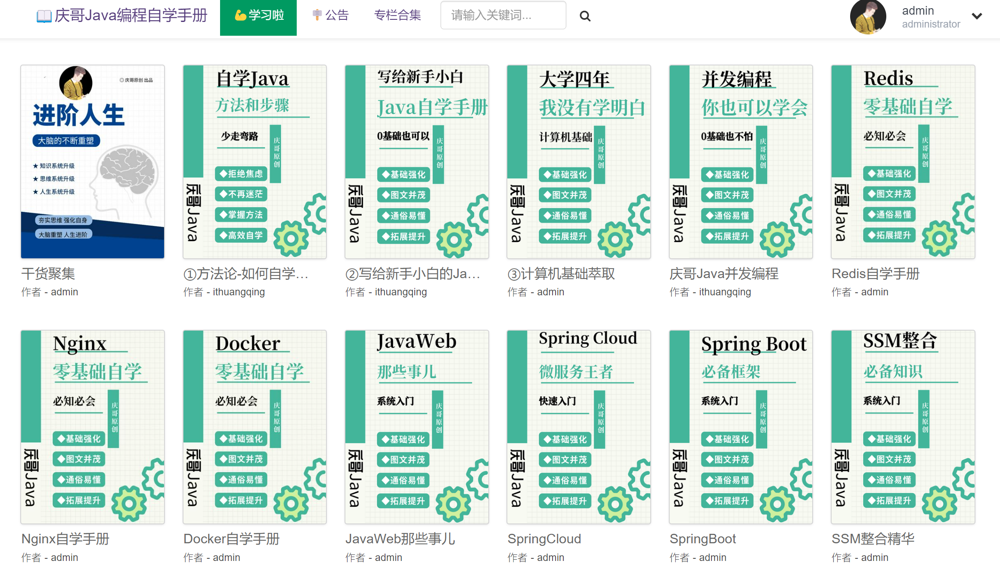

> 学无止境，选择了这个行业就选择了终身学习！

庆哥还持续不断的更新编写了如下内容：

## 内容介绍

以上内容为该开源手册的进阶学习版本，也就是《写给新手小白的Java自学手册》帮助你入门Java，而此时你还远远没有达到能够就业的能力！

如果想要就业，还有很多的内容需要学习，上述内容就是后者，也就是帮助你就业的！

如果你喜欢《写给新手小白的Java自学手册》觉得内容质量还可以的话，可以继续跟随我接下来的手册继续学习，但是很抱歉，剩下的内容将不对外免费开放了，因为都是我个人辛辛苦苦写出来的，耗费了很多的时间和精力，而且需要不断维护！

因此，后续的进阶学习手册需要付费购买，如有需要可以联系我，微信：ithuangqingdev

