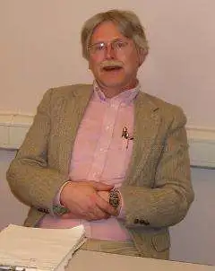

**「我一直觉得自己是个普通人，所以一些共性问题我基本都会遇到」**，我不觉得自己有什么过人的天赋可以让我轻轻松松去解决工作学习和生活中遇到的某些问题，就比如编程自学这块，我也是遇到好多的问题，其「**过程真的是无比痛苦」**，想必一定有感同身受之人！

那面对这个情况，我从很早就产生一个想法，**「在我学习当中，我必须给自己找一个方向，定一个路线，而且是一个正确有效的路线，然后我可以按照这个方向，尽管去努力就好了」**，在我是个不怎么聪明且没有天赋的情况下，我必须有一个可以践行的准则以及指导我前进的方向，否则，我觉得我的人生会很乱，会浪费很多时间也不会有些什么明显的进步！

这就是**我在学习编程中一直很重视学习方法的原因**，**「我觉得有了学习方法之后，学习会更加的明确，也会对未来更加的充满希望」**，尽管我的学习方法可能并不是很正确或者存在不少的瑕疵，但是这些都不重要，只要有了，我觉得就有了方向，我就可以在这个方向上只管努力就行了，而且随着自己的认知不断升级，「我的这个方法也会不断的更新迭代」，但是如果没有这个方法作为根基，那我想，我的学习会是一团糟，就好比那无头苍蝇一般……

------

你相信人和人是有智商差别的吗？

慢慢的我相信了，而且有的人真的让你感觉像神一样，我们学习Java的都应该认识一个神级人物，就是这位：

大名鼎鼎的“Doug Lea”，就是他，写了Java中的并发包，你要是仔细了解他之后，你真的会发出一声感叹:

❝

**人和神是不同的，有的时候不得不承认自己的普通**

❞

在编程学习这件事情上，有些人真的是特别的强，你不服都不行，我就知道很多比我年龄还小的，人家就是架构师，资深专家，被誉为天才少年什么的，不服？不行啊！

在你还在为知识学不会发愁的时候，人家已经是精通各种底层原理了，你怎么比，我曾经咨询过一位这样的大佬：

**“请问你是如何解决知识遗忘的问题呢？记笔记吗？”**

**“不，我从不记笔记，忘了就再看看，用的多了就记住了，用的不多的记它干嘛”**

说的对吗？我觉得很有道理，但是，我知道自己达不到这样的层次，或者说很难去这样做，所以，我还是习惯去记笔记，**「把一些知识学习之后经过自己的思考重新整理梳理，再用自己的话叙述出来，记录下来，我觉得这对我非常有帮助，而且可以帮我解决知识遗忘的问题！」**

在理解了人和人始终存在差别之后，我发现，选择适合自己的才是最重要的！