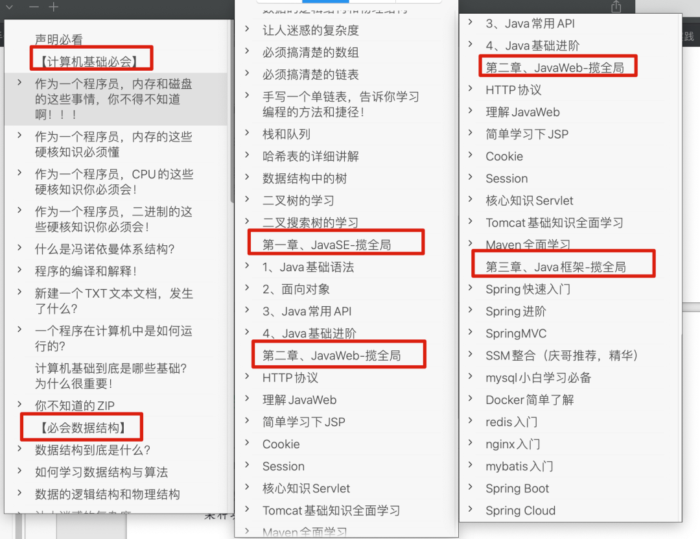

那接下来我将重点解读下我所践行的学习方法，总结起来就一句话：

❝

**系统化学习和教程式笔记**

❞

看起来很简单，理念是需要仔细理解的，否则你是get不到真正的点！

## 系统化学习

我相信现在你一定感觉到，我们**日常生活中的碎片化时间越来越多了**，我不知道你是怎么利用这些碎片化时间的，首先说明一点，我认为，碎片化时间是不适合学习的！

为了让大家有个更清晰的认识，我还是举几个碎片化时间的例子吧：

**1、吃饭的时候，尤其在外面吃饭的时候**

**2、等车，坐车，排队等**

**3、上厕所……**

**4、睡前**

**5、放空**

**6、……**

OK，有这个场景概念了吧，那这些时间我认为是不适合学习的，对于这些时间，我通常这样利用：

**「1、刷抖音」**

**「2、看文章（技术文章一定看自己学过写过的，其他的不看）」**

咋样，我的利用方式和你一样吗？有的人会说，这样的时间，我一般会用来刷剧，其实我之前也会这样，但是慢慢的我发现刷剧这件事情也是需要系统化时间来进行的，否则，幸福感太低！

那说了这么多，**啥是系统化学习呢？**其实对于系统化学习这个概念，网上也有不同解读，可能我这个是最普通的了，**要说系统化学习，需要先说说什么是系统化？**

对比之前说的碎片化时间，**这里的系统化我指的是就是那些系统化的时间来说的**，「所谓系统化的时间就是指的你有可自由利用的一整块的时间，我通常将其限定为最低一小时，也就是说在这一小时里你可以想干什么就干什么，你是可以完全自由支配，不会有人来打断，可以持续利用完这一小时。」

那以上是针对时间而言的系统化，那系统化的学习是怎样的呢？这个要拿碎片化的学习来对比，**什么是碎片化的学习呢？**比如，突然看到一篇讲解CopyOnWriteArrayList，然后你就去看看，然后过了一会又看到讲解IOC的文章，好，再去看看，过了一个小时又在B站看jvm内存模型，晚上的时候又在学习分布式锁，**我把这样的学习称为碎片化的学习**！

看似这一天你又是学习多线程，又是学习虚拟机，还有框架什么的，但是在我看来，没什么用，除了自我满足以外，你的学习并没有什么效果！**「这种碎片化学习是我不提倡的！」**

而且，如果上述碎片化学习过程中你没有任何产出，我觉得就是存粹在消磨时间而已！

❝

**⚠️想一下，为什么你会觉得知识学不完，知识多，学了就忘，学了很多感觉还是不怎么会？get到了吗？**

❞

「怎么办？你需要的是系统化学习！」

上面解释了什么是系统化时间，而这个系统化的学习指得就是「在系统化时间内去集中学习一个专题知识，直到你将其80%的常见知识点都学完！」

举例来说，就是在你可自由支配的这一个小时的系统化时间内集中去学习多线程的知识，当然，可能这一个小时你并不会学完多线程，你也不可能学完，但是你要记住，你的下一个系统化时间一定还是学习这个多线程！

另外，知识都是可以深入挖掘的， 很多都不是你一时间内可以完全掌握的，所以不要想着把所有的都全部弄懂学会，不可能也不现实，只需要掌握80%即可，就是常见的你得学会，怎么把握这个常见，看看面试题会问哪些，面试题上出现的你得搞懂！

总的来说，**「什么是系统化学习？主要就是“系统化”二字，就是****尽量整体，而不是被分散****」**，时间要尽可能是一整块大时间，学习要是集中学习某一块知识，整体，整体，整体，get到了吗？

## 教程式笔记

脱离了“教程式笔记”的“系统化学习”啥也不是！

**我这里介绍的系统化学习和教程式笔记必须是相辅相成的，少了谁都不行，这是一个完整的学习方法**，那**什么是“教程式笔记”？**

说到底还是笔记，但是绝不是最低级的那种笔记，什么是最低级的笔记：

❝

从书中摘抄或者视频中截屏然后粘贴到文档保存

❞

我把这种笔记称作最低级的笔记，我发现有大量的人是这样记笔记的，不能说没用，只能说作用微乎其微，其实最好的一种笔记方式就是写博客，这里面有个很重要的点就是，博客一定是这样的：

**1、对应的知识自己学过一遍**

**2、有自己的理解和思考**

**3、相关代码示例自己实操过**

**4、用自己的话叙述整理**

**5、写出文章，不仅自己能看，别人也可以看**

这才是一篇好的笔记，也是一篇合格的博客，那我这里的教程式笔记就是这样的很多个博客组成的教程，还记得之前说的系统化学习吧，在你进行系统化学习的时候，针对每一个知识点都要写一篇这样的博客，然后整理在一起，分本别类，形成非常系统化完整的一份笔记教程，就比如我学习Java写的这份30万字的教程式笔记：

还不懂什么是教程式笔记的就可以参考我这个来，你就看我这个笔记，是不是不仅仅是笔记啦，马上可以称为一本书了，非常的完整系统！

所以，**系统化学习和教程式笔记是相辅相成的，必须在一起才能发挥作用！**

在你进行了系统化学习和教程式笔记之后，你就可以更好的去利用碎片化时间了，怎么办，就是我之前说的看文章，而且是看那些你系统化学习过的知识点，为啥，一句话说明白“「温故而知新，可以为师矣」”，咋样，get到了吧？

好啦，到了这里，本文的分享就结束啦，以上就是我这四年以来自学编程所有经验的精华总结了，不知道你读懂了多少！建议反复阅读！直到理解！